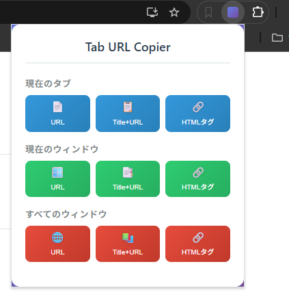

# **Tab URL Copier**

Chromeで開いているタブのURLやタイトルを、用途に合わせて一括コピーできる拡張機能です。  
現在のタブ、現在のウィンドウ、あるいは開いている全てのウィンドウを対象に、「URLのみ」「タイトル \+ URL」「HTMLタグ」の形式でクリップボードにコピーできます。

## **📸 特徴 (Features)**

シンプルなUIから、以下の操作がワンクリックで行えます。

### **1\. 対象範囲の選択**

* **現在のタブ (Current Tab)**: アクティブなタブのみ対象  
* **現在のウィンドウ (Current Window)**: 今見ているウィンドウ内の全タブ対象  
* **すべてのウィンドウ (All Windows)**: 開いている全てのChromeウィンドウのタブ対象

### **2\. コピー形式の選択**

それぞれの範囲に対して、以下の3つの形式でコピー可能です。

* **URL**: URLのみをコピー（複数タブの場合は改行区切り）  
* **Title \+ URL**: サイトタイトルとURLをセットでコピー  
* **HTMLタグ**: ブログやWebサイト埋め込み用に \<a href="..."\>Title\</a\> 形式でコピー

## **🛠️ 使い方 (Usage)**

1. Chromeのツールバーにあるアイコンをクリックしてポップアップを開きます。  
2. コピーしたい範囲（現在のタブ・ウィンドウ・全ウィンドウ）のセクションを見ます。  
3. 希望する形式のボタン（URL / Title+URL / HTMLタグ）をクリックします。  
4. 「コピーしました！」というメッセージが表示されればクリップボードへの保存完了です。
